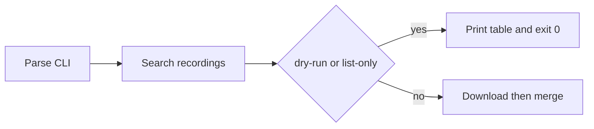

# Add `--dry-run` flag

The listing behavior already exists. In [`cli.py`](cli.py), `--list-only` searches recordings then calls `_render_table` and returns without `RecordingDownloader` or `VideoMerger`. That table already includes start/end times, duration, size, and file path, plus a totals row.

## Implementation

In [`cli.py`](cli.py), register `--dry-run` on the same argument as `--list-only` (same `dest="list_only"` / `action="store_true"`). Keep `--list-only` so existing scripts and [`demo.tape`](demo.tape) keep working.

```python
parser.add_argument(
    "--dry-run",
    "--list-only",
    action="store_true",
    dest="list_only",
    help="List matching recordings (sizes and time ranges) without downloading or merging",
)
```

No change is needed in `_execute`: `args.list_only` already short-circuits after the table.



## Tests

In [`tests/test_cli.py`](tests/test_cli.py):

- Assert `--dry-run` parses to `list_only=True` (and `--list-only` still does).
- End-to-end `CLI.run([... "--dry-run"])` with a mocked `AmcrestClient`:
  - exit code 0
  - `find_recordings` called
  - `download_recording` / `RecordingDownloader` / `VideoMerger` not used
  - stdout includes start/end times and formatted size (reuse the existing recording fixture: `2026-01-16 08:00:00`–`08:15:00`, `1.0 MB`)

Existing `test_run_with_env_password_and_list_only` stays as the `--list-only` regression.

## Docs

Update [`README.md`](README.md) Features, Optional Arguments, and the list-only example so `--dry-run` is the documented name, with `--list-only` noted as an alias.