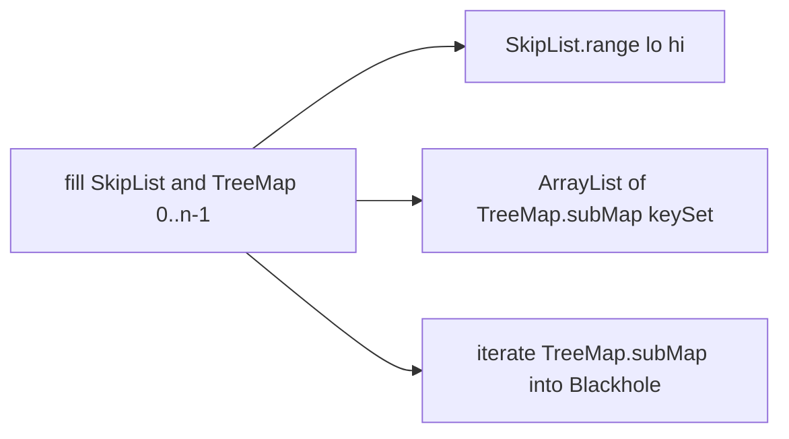

# Range query vs TreeMap.subMap benchmark

Depends on [skip_list_range_query_d3d1b015](skip_list_range_query_d3d1b015): `SkipList.range(K lo, K hi)` returning a snapshot `List<K>` for **[lo, hi)**. That method is not in the tree yet; this work starts after it lands.

## Goal

Measure **range scan cost**, not insert/get. Both structures are theoretically O(log n + k). The interesting comparison is the shipped APIs: skip-list snapshot vs `TreeMap.subMap` view (plus the extra list copy to match the snapshot).

Do **not** run JMH in GitHub Actions. [`.github/workflows/ci.yml`](.github/workflows/ci.yml) stays `./gradlew build`.

## Gradle

In [`app/build.gradle`](app/build.gradle):

- Apply [`me.champeau.jmh` 0.7.3](https://plugins.gradle.org/plugin/me.champeau.jmh) (Gradle 9 / JDK 21).
- Keep `jmh` off the `build`/`check` graph (plugin default).
- Optional `jmh { }` block only to pin a short local profile (e.g. 1 fork, 3 warmup / 5 measurement iterations, microseconds) so `./gradlew jmh` is usable without a long flag string.

Sources live in `app/src/jmh/java/` (plugin convention).

## Fairness

`range` allocates and copies keys. `TreeMap.subMap` is a **live view**. Two `@Benchmark` methods on the same filled maps and the same `(lo, hi)`:

- `skipListRange` — `skipList.range(lo, hi)` (the real API).
- `treeMapSubMapCopy` — `new ArrayList<>(tree.subMap(lo, hi).keySet())` (same snapshot contract the tests already compare against).

Add a third method `treeMapSubMapIterate` that walks `tree.subMap(lo, hi).keySet()` into a `Blackhole` with **no** `ArrayList`. That isolates view iteration from copy cost; it is not a claim that the APIs are equivalent.

Return or blackhole the result so the JIT cannot drop the scan.

## Workload

One `@State(Scope.Benchmark)` class, Integer keys, dense fill `0 .. n-1` into both a `SkipList` (default `p = 0.5`) and a `TreeMap`. Same keys, same `(lo, hi)` every iteration.

`@Param` matrix (small enough for a laptop run):

- `n`: `10000`, `100000`
- `k`: `10`, `1000`, `10000` (result size; skip combinations where `k > n`)

Place the window in the middle of the key space, e.g. `lo = n / 4`, `hi = lo + k`, so the scan is neither prefix-only nor empty. `@Setup` can skip or clamp invalid `k > n` params if Gradle still expands the full cartesian product—prefer documenting “ignore k > n” or using a single combined `@Param` string like `"10000:10"` if clamping is messy.

Do not randomize `(lo, hi)` inside `@Benchmark` (adds noise). Do not measure `put`.

JMH annotations: `Mode.AverageTime`, `TimeUnit.MICROSECONDS`.

## Docs and CI

- Add a short **Benchmarks** subsection to [`README.md`](README.md): `./gradlew jmh`, what is compared, and that results are machine-local (not CI).
- No change to unit tests or CI. JUnit remains correctness-only.

